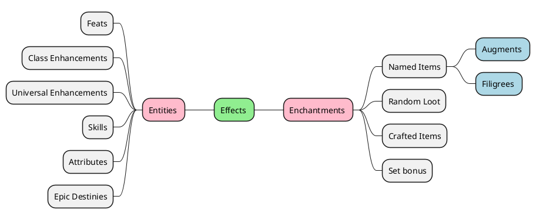

# Major building blocks

## Effect building

Effects are coming from several sources, and we need to get them into a common database.

1. Entities
2. Named items
3. Random Loot
4. Crafted Items
5. Augments / Filigrees
6. Set Bonuses from the above
7. Temporary effects (Spells / Potions etc.)



### Entity effects

Entities in this context include All feats, enhancements, destinies, skills, attributes etc. These are represented by
code as it allows a higher order of knowledge in the application due to logic such as complex requirements (class /
level / alignment / race etc.) and interactions. The public facing API will consist of simple typed case classes, while
the core api is typed with stacking traits. One of the downsides of this approach is that there is a bit more duplicity
redundancy and obviously coding. The upside is that scala logic can be applied functionally with filter / map, case and
pattern matching natively. Most entities are also implemented as Enumerations so Skills, Races, Classes etc. are visible
in the IDE with smart-completion, compile time checking
and [exhaustive matching](https://docs.scala-lang.org/tour/pattern-matching.html).

i.e.

```scala
import io.truthencode.ddo.model.effect.Feature
import io.truthencode.ddo.model.skill.Skill
import org.scalatest.matchers.should.Matchers
// import any scalatest spec

// Alertness should have two effects, +2 to Listen and Spot skills.
val alertness = GeneralFeat.Alertness
// withPrefix sets the ID to "Skill:Listen"
val listen = Skill.Listen.withPrefix
val spot = Skill.Spot.withPrefix

alertness.features.size shouldBe 2
val named = al.namedFeatures.keys.toList
(named should contain).allOf("Skill:Listen", "Skill:Spot")

// we could also verify the value == 2 or trigger is Passive etc.
```

These are contained in the ddo-core module and effects need to be added into the local / cloud databases. Required
Modules: ddo-core

### Named Items

[Named Items](https://ddowiki.com/page/Category:Named_items_by_update) include all named equipment from quests, raids etc. These effects need to be parsed from a text source.

An additional layer is needed to parse these values as we are capturing the actual effects as opposed to a basic regular
expression against the source. I.e. [Cloak of the Zephyr](https://ddowiki.com/page/Item:Cloak_of_the_Zephyr) grants
several enchantments including Blurry, invisibility guard and a Set Bonus, but that is not the same as effects to this
program. The enhancement Blurry might translate to a named enchantment that provides the effect MissChance:Concealment
with a value of 20% with a trigger type of OnEquipped.

While it's fairly trivial to parse a source site such as ddowiki or ddocompendium, there needs to be a mechanism to
translate these enchantments into effects. It also needs to fail gracefully when an unknown effect is encountered. The
general plan is to queue unknown effects, capturing the source reference (i.e. the Item / location containing) and using
a slug (unknown effect placeholder)

Required Modules: ddo-etl, ddo-dao

### Random Loot

This is one of the main goals of this application. While I'm sure many players have their build-outs spec'd and geared
in all named items, I personally do not. While I know I want to end up with a particular item, I almost always have some
patch / swap with some random loot while I wait for that drop. This has the effect of being unable to use a planner to
see my true stats.

Random loot has the same basic translation of known effects and can use the same enhancement parser. However, it
requires a source of known effects and 'applies to'. I am not trying to meta reconstruct the entire DDO random loot
table. However, I think we should be able to 'craft a basic approximation' and possibly tune it based on user input.

Required Modules: ddo-etl, ddo-dao

### Crafted items

The basic Crafted Items should be included. This includes the 'real' and 'pseudo' items. Several of these effects
overlap with random loot which is nice. The early milestones will target Cannith and some newer 'turn-in' upgrades such
as Perfected and Legendary items.

Even if this and random loot are not fully comprehensive, simply having the ability to query based on "I have an 'X'
slot available, and I'm trying to increase my 'Y'" could now return a list of effects that let you know there are
craft-able, named items or random loot effects available (or unavailable) even if it doesn't have a specific item. I.e.
it will be aware that an Insight Bonus to 'Y' can be Cannith crafted to that 'X' slot, but random loot only has that
effect on a different slot.

### Augments / Filigrees

These will follow the same principles as the Named items.

### Set Bonus

Set bonuses will be handled in the same way as any other named enchantments, with a triggerOn condition of 'X' equipped items / augments.
Required Modules: ddo-etl, ddo-dao

### Temporary effects

These will be named effects with a triggerOff condition of some time duration, on Death, on dispel etc.
I am currently unsure if they will be implemented as code, some data structure (dat file, csv, xml, json or etl database load)

Required Modules: TBD
