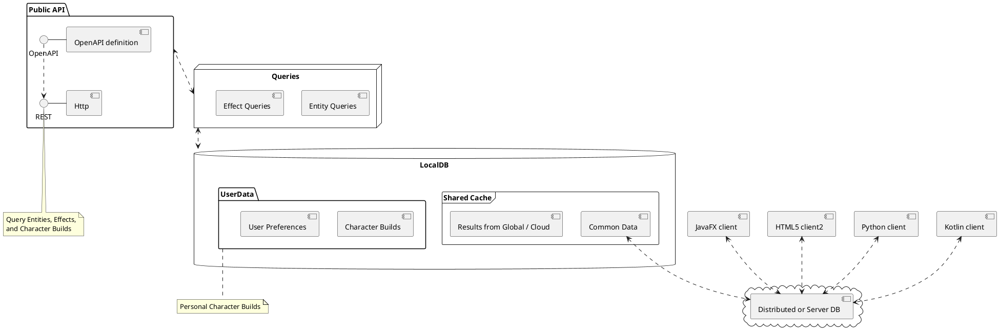

```plantuml

@startuml
'https://plantuml.com/component-diagram

package "Public API" as PA {
  OpenAPI - [OpenAPI definition]
  REST - [Http]
}

node "Queries" {
  [Entity Queries] as Entities
  [Effect Queries] as Effects
}

database "LocalDB" {
  folder "UserData" {
    [Character Builds]
    [User Preferences]
  }
  frame "Shared Cache" {
    [Common Data] as CData
    [Results from Global / Cloud]
  }
}

note bottom of UserData
  Personal Character Builds
end note

note Bottom of REST
  Query Entities, Effects,
  and Character Builds
end note

cloud {
  [Distributed or Server DB] as Cld
}

[JavaFX client] as c1
[HTML5 client2] as c2
[Python client] as c3
[Kotlin client] as c4

OpenAPI ..> REST
PA <..> Queries
Queries <..> LocalDB
CData <..> Cld
c1 <..> Cld
c2 <..> Cld
c3 <..> Cld
c4 <..> Cld
url of OpenAPI is [[https://www.openapis.org OpenAPI{YAML / JSoN}]]

@enduml
```
