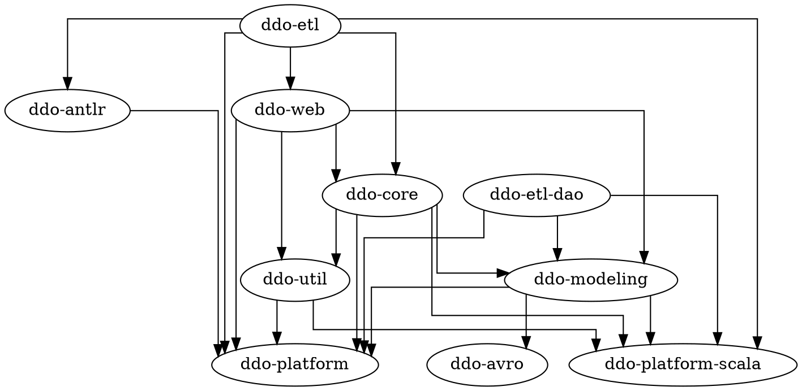

# Projects and Dependencies

Current Inter-project layout

```dot

strict digraph {
  splines=ortho
  "ddo-etl" -> "ddo-platform"
  "ddo-etl" -> "ddo-platform-scala"
  "ddo-etl" -> "ddo-antlr"
  "ddo-etl" -> "ddo-web"
  "ddo-etl" -> "ddo-core"
  "ddo-modeling" -> "ddo-avro"
  "ddo-modeling" -> "ddo-avro"
  "ddo-modeling" -> "ddo-avro"
  "ddo-modeling" -> "ddo-platform"
  "ddo-modeling" -> "ddo-platform-scala"
  "ddo-core" -> "ddo-platform"
  "ddo-core" -> "ddo-platform-scala"
  "ddo-core" -> "ddo-util"
  "ddo-core" -> "ddo-modeling"
  "ddo-core" -> "ddo-modeling"
  "ddo-util" -> "ddo-platform"
  "ddo-util" -> "ddo-platform-scala"
  "ddo-antlr" -> "ddo-platform"
  "ddo-web" -> "ddo-platform"
  "ddo-web" -> "ddo-core"
  "ddo-web" -> "ddo-modeling"
  "ddo-web" -> "ddo-util"
  "ddo-etl-dao" -> "ddo-platform"
  "ddo-etl-dao" -> "ddo-platform-scala"
  "ddo-etl-dao" -> "ddo-modeling"
  }
```
