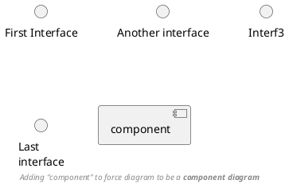
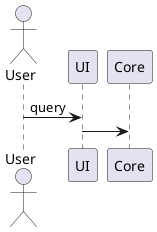
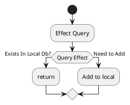
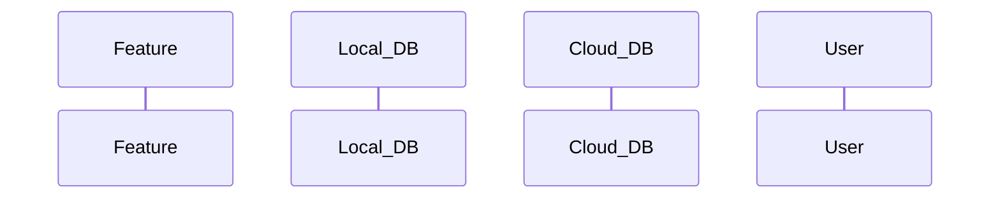
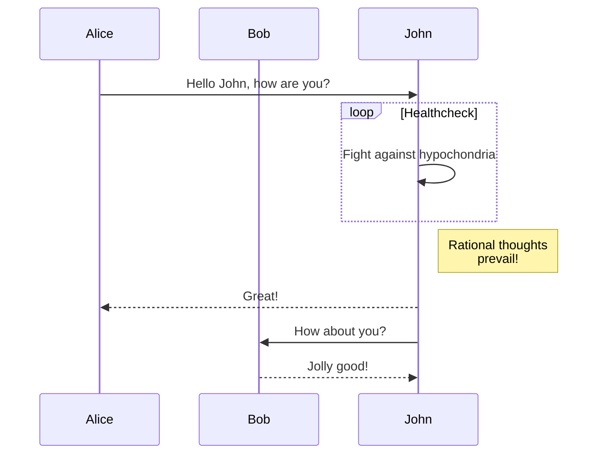

```plantuml
@startuml

() "First Interface"
() "Another interface" as Interf2
interface Interf3
interface "Last\ninterface" as Interf4

[component]
footer //Adding "component" to force diagram to be a **component diagram**//
@enduml
```


```plantuml
@startuml

actor User as user
participant UI as ui
participant Core as core


user -> ui : query
ui -> core


@enduml
```


```plantuml
@startuml
start
:Effect Query;

if (Query Effect) is (Exists In Local Db?) then
    :return;
else (Need to Add)
    :Add to local;


@enduml
```

```scala

val list = Seq("bog","larry")
```


```mermaid
sequenceDiagram
    participant Feature
    participant Local_DB
    participant Cloud_DB
    participant User


```


```mermaid
sequenceDiagram
    participant Alice
    participant Bob
    Alice->>John: Hello John, how are you?
    loop Healthcheck
        John->>John: Fight against hypochondria
    end
    Note right of John: Rational thoughts <br/>prevail!
    John-->>Alice: Great!
    John->>Bob: How about you?
    Bob-->>John: Jolly good!
```
